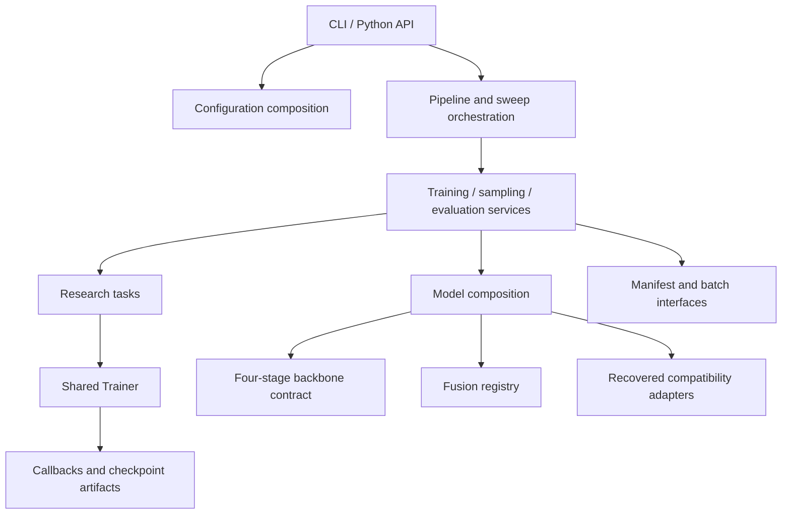

# Implementation notes

Generation, semantic supervision and recognition are implemented as separate
models and learning tasks. This document describes where to change a model,
loss or training setting.

## Module dependencies



`Trainer` depends on a task contract, not on `SketchLDM` or `DefectClassifier`.
Model modules do not import the engine or orchestration. CLI parsing does not
define training objectives. Import adapters do not determine a new scientific
split when an explicit split is supplied.

## Backbone and fusion interfaces

`BackboneParts` describes a stem, four stages, a normalization module and a
`FeatureSpec`. The spec carries stage channels, spatial reductions and layout;
the backbone contract also declares normalization before or after pooling.
The classifier converts Swin's NHWC features to NCHW at fusion boundaries and
back to the backbone's native layout before the next stage. A spatial prior can
therefore be fused without duplicating the classifier for each architecture.

Native paper fusion is applied after the first three visual stages:

```text
visual stem -> stage 1 -> fusion -> stage 2 -> fusion -> stage 3 -> fusion -> stage 4 -> head
Sobel prior -> edge stem -> edge stage 1 -> edge stage 2 -> edge stage 3
```

The outer residual follows the implemented interpretation of the paper diagram:
`visual + fusion(visual, prior)`. All registered alternatives use that same outer
residual. Additive and concatenation fusion are additional ablations, not reported
paper results. Different layouts and odd spatial sizes are handled at the fusion
boundary; the original compatibility path preserves the backed-up behavior.

Add an experimental fusion without modifying the training engine:

```python
import torch
from torch import nn
from pvaug.models.fusion import FUSIONS
from pvaug.models import DefectClassifier
from pvaug.config import ModelConfig

class ScalarPriorFusion(nn.Module):
    def __init__(self, channels, edge_channels):
        super().__init__()
        self.project = nn.Conv2d(edge_channels, channels, 1, bias=False)
        self.scale = nn.Parameter(torch.zeros(()))

    def forward(self, visual, prior):
        return self.scale.sigmoid() * self.project(prior)

@FUSIONS.register("scalar_prior")
def build_scalar(channels, edge_channels, reduction=4):
    return ScalarPriorFusion(channels, edge_channels)

model = DefectClassifier(ModelConfig(variant="paper", fusion_kind="scalar_prior"))
```

Registries reject duplicate names and list available names for unknown components.
Registration is explicit Python code; configurations do not import arbitrary
modules. Load your extension before composing its configuration in the Python API.

## Task contract

The `Task` protocol declares:

| Member | Purpose |
|:--|:--|
| `model`, `kind`, `artifact` | Trainable network, checkpoint identity and returned artifact |
| `train_step(batch, epoch)` | Scalar mean loss, detached metric values and sample count |
| `validate(device)`, `score(train, validation)` | Optional validation and checkpoint selection |
| `after_optimizer_step()` | Auxiliary updates such as diffusion EMA |
| `state_dict()`, `load_state_dict(state)` | Auxiliary task state for resume |
| `epoch_metadata(epoch)` | Method-specific history fields, such as semantic-loss alpha |

`ResearchTask` provides defaults. A new objective can usually override only
`train_step`. `ClassificationTask` owns frozen-teacher supervision and the alpha
schedule; `DiffusionTask` owns noise prediction and EMA; `AutoencoderTask` owns
the optional reconstruction/codebook bootstrap.

```python
import torch.nn.functional as F
from pvaug.engine import StepResult, Trainer
from pvaug.tasks import ResearchTask

class LabelSmoothingTask(ResearchTask):
    kind = "classifier"
    artifact = "best.pt"

    def __init__(self, model):
        self.model = model

    def train_step(self, batch, epoch):
        logits = self.model(batch["image"], batch["edge"])
        loss = F.cross_entropy(logits, batch["label"], label_smoothing=0.1)
        return StepResult(loss, {"smoothed_ce": loss.detach()}, len(batch["label"]))

# cfg is a TrainConfig; loader_factory(epoch) returns that epoch's DataLoader.
# Trainer(LabelSmoothingTask(model), cfg, loader_factory, "cpu").fit()
```

The engine moves tensor batches to the target device, enters autocast, accumulates
sample-weighted gradients, unscales and clips them, updates the optimizer, and
then invokes the task's auxiliary update. The final partial accumulation group
uses its actual sample count. This is loss normalization equivalence, not
BatchNorm equivalence.

## Lifecycle and callbacks

```text
fit start
  -> epoch training
       -> optimizer update -> auxiliary state -> optimizer callbacks
  -> validation -> selection -> scheduler update
  -> history -> checkpoint -> console callbacks
fit end
```

User callbacks are inserted between the history writer and checkpoint writer,
in the order supplied. Keep validation and mathematical state changes in the
task; use callbacks for observability or artifact integrations.

```python
from pvaug.engine import Callback

class LearningRateTrace(Callback):
    def on_optimizer_step(self, trainer):
        self.latest_lr = trainer.optimizer.param_groups[0]["lr"]

# Trainer(task, cfg, loader_factory, device, callbacks=[LearningRateTrace()])
```

Supported events are `on_fit_start`, `on_optimizer_step`, `on_epoch_end`,
`on_fit_end` and `on_exception`. The default runtime writes `config.json`,
`environment.json`, `data_audit.json`, `history.jsonl`, `last.pt` and `best.pt`.
VQ training also exposes `first_stage.pt`. Optional numbered snapshots use
`trainer.engine.checkpoint_every` when greater than one.

## Checkpoint and recovery semantics

Format v2 checkpoints contain model/configuration, epoch/update counters,
selection score, optimizer, scheduler, scaler, RNG states, audit information
and auxiliary task state. The loader accepts older framework configurations
with defaults for newly introduced fields. Raw legacy conversion remains strict.

Recovery starts at the next epoch. In-progress, uncheckpointed work is repeated.
A `max_steps` debug limit may terminate partway through an epoch and writes that
truncated epoch as a completed boundary. It is not a mid-epoch sampler snapshot.
Configuration changes other than output location, device and worker count are
rejected. Exact tensor equality has been tested on controlled CPU classification
resume; cross-device determinism is not guaranteed.

The trainer is single-device. The implementation supports CUDA precision options,
but the executed validation environment is CPU; distributed training is not part
of this release.

## Configuration layers

Public YAML groups reflect the experiment: data, model, optimization, runtime,
semantic supervision and run identity. They compile to dataclasses stored in
checkpoints. This keeps checkpoint loading independent of where preset files
were located or how they inherited one another.

Composition order is parent defaults → current file → explicit overrides.
Interpolation resolves after composition. Schema validation checks unknown keys,
value types, method constraints and registered native model names.

## Loading earlier weights

`models/compatibility.py` builds and executes recovered networks; its adapters
preserve the original state names beneath `core.*`. `models/recovered/` and
`reference/` retain author source snapshots. The native factories preserve the
v1 native parameter layout, so adding registry boundaries does not rename those
checkpoint tensors.

The old CLI is isolated in `legacy_cli.py`; modern commands use the composed
configuration and orchestration APIs. Old commands delegate to the same assembly
services and the shared engine. No duplicate optimization loop is maintained.
